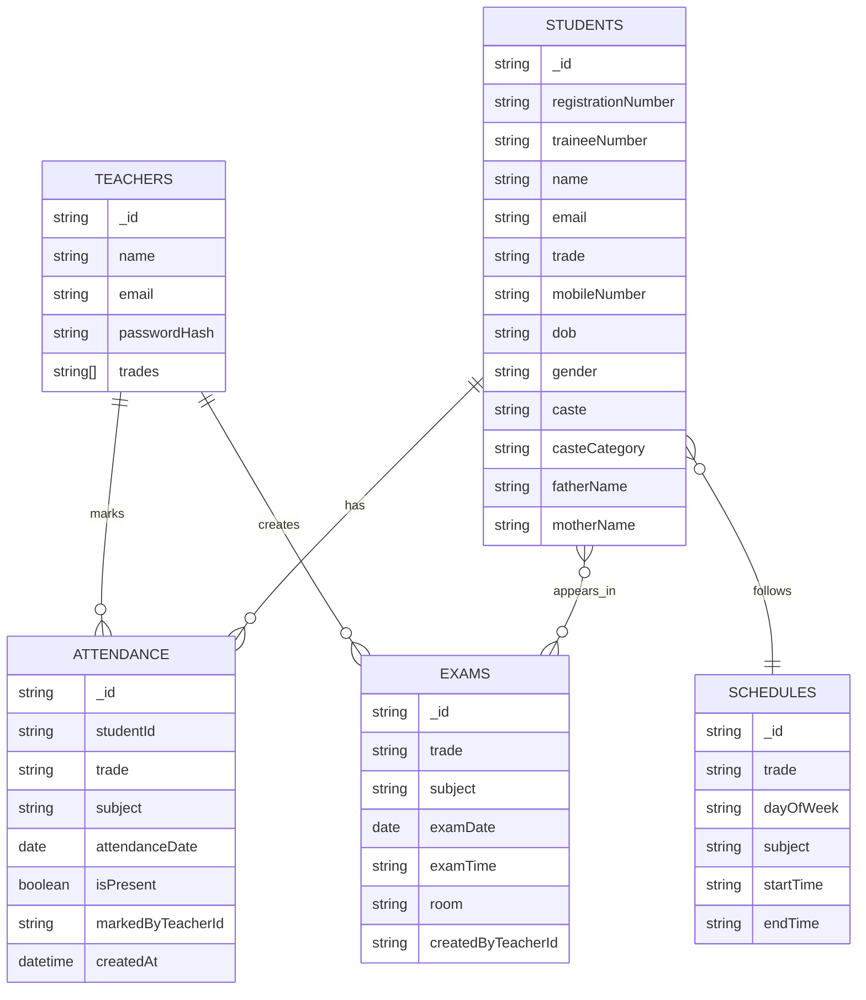

# MongoDB Schema Diagram

```mermaid
erDiagram
    TEACHERS {
        string _id
        string name
        string email
        string passwordHash
        string[] trades
    }

    STUDENTS {
        string _id
        string registrationNumber
        string traineeNumber
        string name
        string email
        string trade
        string mobileNumber
        string dob
        string gender
        string caste
        string casteCategory
        string fatherName
        string motherName
    }

    ATTENDANCE {
        string _id
        string studentId
        string trade
        string subject
        date attendanceDate
        boolean isPresent
        string markedByTeacherId
        datetime createdAt
    }

    EXAMS {
        string _id
        string trade
        string subject
        date examDate
        string examTime
        string room
        string createdByTeacherId
    }

    SCHEDULES {
        string _id
        string trade
        string dayOfWeek
        string subject
        string startTime
        string endTime
    }

    TEACHERS ||--o{ ATTENDANCE : marks
    TEACHERS ||--o{ EXAMS : creates
    STUDENTS ||--o{ ATTENDANCE : has
    STUDENTS }o--|| SCHEDULES : follows
    STUDENTS }o--o{ EXAMS : appears_in
```
